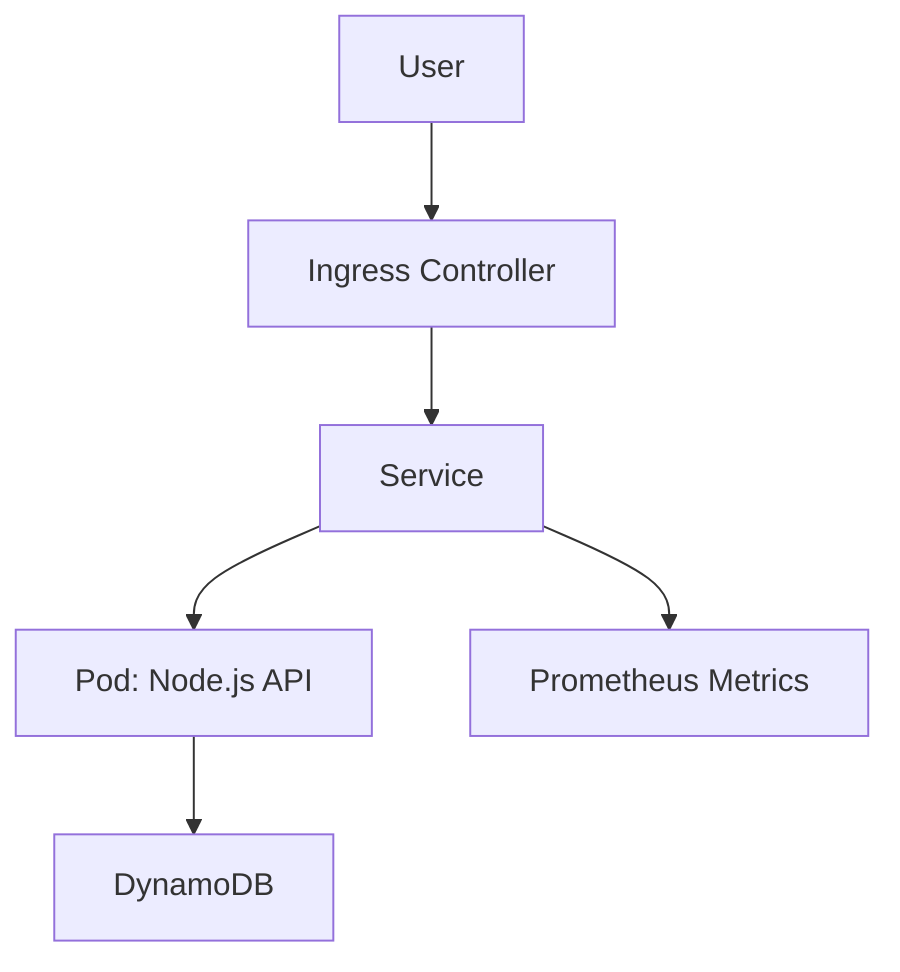

<p align="center">
<<<<<<< HEAD
  
</p>
=======
  
</p>

<p align="center">
  
  
  
</p>

<h3 align="center">Production-ready microservice: Node.js • Docker • Terraform • EKS • CI/CD • Security</h3>

---

>>>>>>> d9bd031 (Fix ci-cd deploy workflow)

<p align="center">
  
  
  
  
</p>

<h3 align="center">Production-ready microservice • Node.js • Docker • Terraform • EKS • GitHub Actions • Security</h3>

---

## 📌 Quick links
- 🔗 Repository: `DevOps-Cloud-Security-Engineer-Assessment`  
- 👨‍💻 Author: **Piyush Gupta**  
- 📄 Live CI: check the badge above for latest run

---

## 🧾 Table of Contents

- [📌 Quick Links](#quick-links)
- [👋 Overview](#overview)
- [🧰 Tech Stack](#tech-stack)
- [🏗️ Architecture](#architecture)
- [⚙️ Quickstart (Local)](#quickstart-local)
- [🧩 CI / CD (GitHub Actions)](./.github/workflows/ci-cd.yaml)
- [☁️ Infrastructure (Terraform)](./infra/terraform/)
- [🧭 Kubernetes Manifests](./k8s/)
- [🔐 Security & Hardening](#security--hardening)
- [✅ Testing & Validation](#testing--validation)
- [🧠 Section 2 — Scenario-Based Answers](#section-2--scenario-based-answers)
- [📘 Section 3 — Short Answers](#section-3--short--answers)
- [🧩 Bonus (Optional Differentiators)](#bonus-optional-differentiators)
- [🧾 What to Submit — Final Deliverables](#what-to-submit--final-deliverables)
- [💬 Contact](#contact)

---

## 👋 Overview
This repository is a **Complete submission** for a DevOps & Cloud Security Engineer assessment.  
It presents a Todo microservice that demonstrates robust CI/CD, IaC, containerization, Kubernetes deployment, and security best practices.

**Highlights**
- Small, testable Node.js API with `/healthz`, `/metrics`, and `/api/v1/todos`.  
- Multi-stage Dockerfile and non-root runtime image.  
- GitHub Actions pipeline: lint → test → build → Trivy scan → deploy.  
- Terraform skeleton for VPC, EKS, DynamoDB, and IRSA (least-privilege IAM).  
- Secure K8s manifests (probes, resources, securityContext, NetworkPolicy).

---


----------

## 🧰 Tech Stack

| Area | Tools |
|---|---|
| Language | Node.js (Express) |
| Container | Docker (multi-stage) |
| Orchestration | Kubernetes (EKS) |
| Infra as Code | Terraform |
| CI/CD | GitHub Actions |
| Registry & Scanning | GHCR, Trivy |
| DB | DynamoDB (AWS) |
| Observability | prom-client (metrics) |

---  

## 🏗️ Architecture



<p align="center">
  
</p>


## 🧠 Section 2 — Scenario-Based Answers 

###  1. EKS Pod Egress Spike (Incident Response)
If outbound network traffic from EKS suddenly spikes, I would:
1. Check CloudWatch metrics and VPC Flow Logs to confirm the pattern.
2. Use `kubectl top pods` and `kubectl get pods -o wide` to identify the pod/namespace.
3. Isolate the pod via NetworkPolicy or temporarily cordon its node.
4. Collect container logs, image ID, and recent deployment history for forensics.
5. Re-deploy from a trusted base image once the root cause is found.

---

### 🔐 2. Secrets Management (.env Risks)
Never store `.env` files in source control.  
Instead:
- Store secrets in **AWS Secrets Manager** or **SSM Parameter Store**.  
- Reference them in Terraform (`data "aws_secretsmanager_secret"`).  
- Inject values through **IRSA** or **GitHub Actions secrets**.  
- Rotate credentials periodically and avoid printing them in logs.

---

### 🧱 3. Zero Trust in Kubernetes
Zero Trust in K8s is implemented using:
- **IRSA** → pod-level IAM with least privilege.  
- **RBAC** → limit verbs/resources for each ServiceAccount.  
- **NetworkPolicy** → default deny, allow only necessary communication.  
- **Admission Control (OPA/Gatekeeper)** → enforce non-root pods and read-only FS.  

Together, these ensure no implicit trust across workloads.

---

### ⚙️ 4. Supply Chain Security
To secure the CI/CD supply chain:
- Pin base images (`FROM node:20-alpine@sha256:...`) for immutability.  
- Use `npm ci` for deterministic dependency installs.  
- Scan images & dependencies with **Trivy** and **npm audit** in CI.  
- Sign container images using **cosign** and generate an **SBOM (Syft)** for traceability.  

This ensures end-to-end integrity and reproducibility.

---

### 💰 5. Cost vs Security (Image Scanning)
Full Trivy scans on every commit can be expensive.  
To balance performance and cost:
- Run **Quick Scans** on PRs and **Full Scans** nightly.  
- Cache vulnerability DB in CI runners.  
- Fail pipelines only for **High/Critical** CVEs.  

This approach optimizes CI time without compromising coverage.

---

## 📘 Section 3 — Short  Answers
---

### 1️⃣ AWS Security Group vs NACL
- **Security Groups:** Stateful, instance-level firewalls applied to ENIs.  
- **Network ACLs:** Stateless, subnet-level rules evaluated on every packet.  
Use SGs for instance access control; NACLs for subnet-wide filtering.

---

### 2️⃣ Terraform State — Purpose & Security
Terraform state maintains mappings between configuration and actual cloud resources.  
**Secure it by:**
- Storing in **S3 with versioning & KMS encryption**.  
- Locking with **DynamoDB**.  
- Restricting access via **IAM roles/policies**.

---

### 3️⃣ Container/Image Scanning Tools
1. **Trivy** → CI/CD integrated image and dependency scanning.  
2. **Grype** → SBOM-based CVE detection and policy enforcement.

---

### 4️⃣ Kubernetes RBAC ConfigMap Access
Grant minimum privileges using Role & RoleBinding:
```yaml
kind: Role
apiVersion: rbac.authorization.k8s.io/v1
metadata:
  name: configmap-reader
rules:
  - apiGroups: [""]
    resources: ["configmaps"]
    verbs: ["get", "list"]
```

# 🧠 Bonus (Optional Differentiators) — Implemented Features & Answers

### 🌀 1. Helm Chart with Dev/Stage/Prod Values
Helm was used to template Kubernetes manifests for **multi-environment deployments**.  
Three values files — `values-dev.yaml`, `values-stage.yaml`, and `values-prod.yaml` — control replica counts, resource limits, and environment variables.

**Benefits:**
- Consistent manifest structure across all environments.  
- Easier environment-specific overrides without code duplication.  
-----------
  
**🧱 2. Admission Controls — OPA Gatekeeper / Kyverno Policy**

  A Kyverno ClusterPolicy was added to enforce container security and resource hygiene.

**Benefits:**

**1-Prevents privilege escalation.**
**2-Guarantees every deployment follows security best practices.**
----------------------

**🧾 3. SBOM Generation (Syft) and Attestation in CI** : A Software Bill of Materials (SBOM) was integrated using Syft and Cosign in the GitHub Actions CI pipeline.
Each build automatically generates an SBOM (sbom.json) and attaches it as an artifact.

**Benefits:**

1- Improves supply chain transparency.

2- Allows vulnerability scanning and attestation validation before release.

3- SBOM stored with the pipeline artifacts for traceability.
-----------

🧰 4. OWASP ZAP Baseline Scan in CI : To detect web vulnerabilities early, an OWASP ZAP Baseline Scan was added to CI/CD against the dev endpoint.

**Benefits**

1- Detects common OWASP Top 10 risks before merging.
  
2- Provides automated security validation without manual testing.

3- Generates a report that can be viewed in GitHub Actions artifacts.
--------
🔄 5. Blue/Green Deployments — Weighted Target Groups / Argo Rollouts

Argo Rollouts was configured to enable blue-green deployments using weighted target groups on ALB.
This ensures zero downtime during version upgrades.

**Benefits:**

1-Provides controlled release strategy and rollback capability.

2-Enables real-time traffic shifting between versions.

3-Supports automated testing of new versions before full rollout.
--------------------

## 🧾 What to Submit — Final Deliverables

Below is the complete structure and submission checklist for the **DevOps & Cloud Security Engineer Assessment**.  
Each required component is implemented and available in this repository.

### 📦 Repository URL
🔗 **Repo:** [https://github.com/guptapiyushraj471-cpu/DevOps-Cloud-Security-Engineer-Assessment](https://github.com/guptapiyushraj471-cpu/DevOps-Cloud-Security-Engineer-Assessment)

---

### 1️⃣ `src/` — Node.js Service, Tests, Dockerfile
**Folder:** `src/`  
Contains the Node.js microservice with health, metrics, and todo APIs.

| Component | Description |
|------------|-------------|
| `src/server.js` | Express.js server exposing `/healthz`, `/metrics`, `/api/v1/todos`. |
| `src/routes/todos.js` | Handles CRUD operations for todos. |
| `tests/api.test.js` | Jest + Supertest suite covering positive and negative cases. |
| `Dockerfile` | Multi-stage build, non-root user, minimal image size. |

✅ Includes linting, structured logging, Prometheus metrics, and Jest tests.

---

### 2️⃣ `infra/terraform/` — Infrastructure as Code (VPC, EKS, IRSA, DynamoDB)
**Folder:** `infra/terraform/`

Implements **AWS infrastructure provisioning** using Terraform:
| File | Purpose |
|------|----------|
| `backend.tf` | Defines remote backend (S3 bucket + DynamoDB lock). |
| `main.tf` | Creates VPC, EKS cluster, DynamoDB table, and IAM Role (IRSA). |
| `outputs.tf` | Exports EKS cluster name, DynamoDB table name, IAM role ARN. |

✅ IRSA implemented for pod-level IAM.  
✅ Backend configured for secure remote state management.  

---

### 3️⃣ `k8s/` or `charts/` — Kubernetes Deployment Configuration
**Folder:** `k8s/`

| File | Description |
|------|--------------|
| `deployment.yaml` | Deploys app with liveness/readiness probes, resource limits, non-root container. |
| `service.yaml` | Exposes app internally via ClusterIP. |
| `ingress.yaml` | Handles external routing through ALB/Ingress Controller. |
| `namespace.yaml` | Defines isolated namespace for the app. |
| `networkpolicy.yaml` | Default-deny ingress/egress policy for Zero Trust enforcement. |

✅ Helm chart option (`src/helm/`) included for multi-environment values.  
✅ Compatible with Blue/Green rollout strategies (Argo).

---

### 4️⃣ `.github/workflows/ci-cd.yaml` — CI/CD Pipeline
Implements a **multi-stage GitHub Actions pipeline**:
| Stage | Purpose |
|--------|----------|
| `build-test` | Lint, install, and run Jest tests. |
| `build-and-publish` | Build Docker image and push to GHCR. |
| `scan` | Run Trivy + npm audit for vulnerabilities. |
| `deploy` | Apply manifests to EKS using `KUBE_CONFIG_DATA` secret. |
| `attest` | Generate SBOM (Syft) and attest with Cosign. |

✅ Fully automated workflow with image provenance and environment tagging.

---

### 5️⃣ `README.md` — Documentation & Architecture
This README includes:
- 🧩 **Setup & Deploy Instructions**  
- 🏗️ **Architecture Diagram (Mermaid)**  
- 🔐 **Security Measures & Threat Model**  
- ⚖️ **Trade-offs & Future Improvements**

✅ Also includes:
- Section 2 (Scenario Answers)  
- Section 3 (Short Answers)  
- Bonus (Optional Differentiators)

---

## 💬 Contact

<p align="center">
  <b>👨‍💻 Piyush Gupta</b> <br/>
  🚀 DevOps • Cloud • Security Engineer <br/><br/>
  <a href="mailto:guptapiyushraj471@gmail.com"></a>
  <a href="https://www.linkedin.com/in/piyush-gupta-10a0546bb/"></a>
  <a href="https://github.com/guptapiyushraj471-cpu"></a>
</p>

<p align="center">
  💡 *Made with ❤️ and DevSecOps project*  
</p>

------------------------------------
